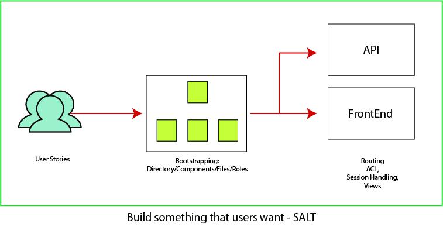

# Salt

## Salt is a full stack framework written in C

The technical goal is to optimize the framework for:
1. Speed
2. Lightweight
3. Portability across platforms including embedded systems
4. Compatibility with other languages like Node, python or PHP as a C extension

### How to get started?

### Installation 

